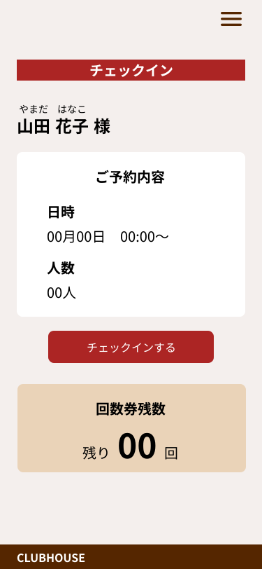
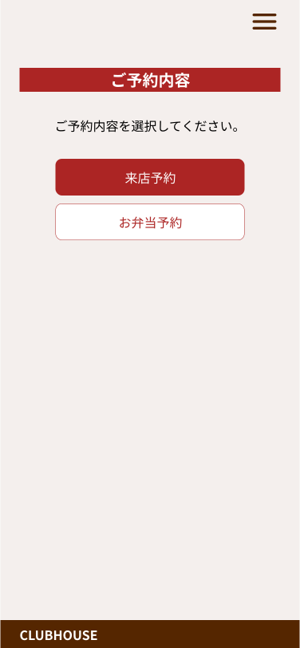
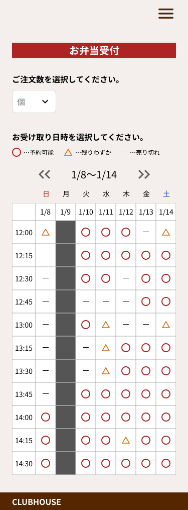
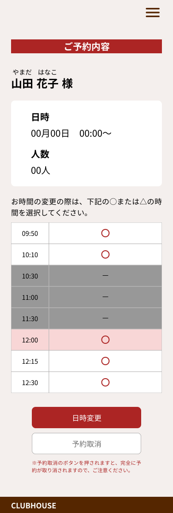
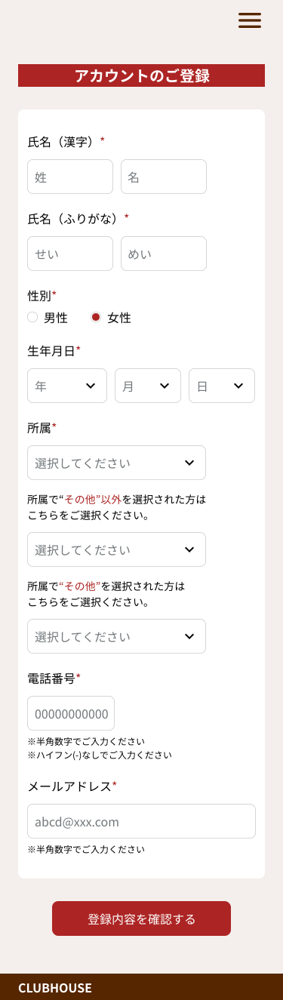
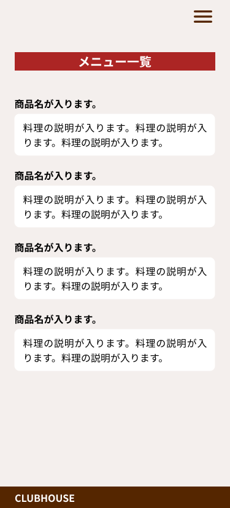
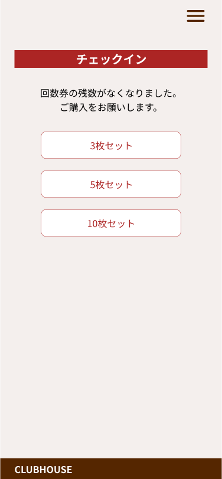

# 要件定義（スマホ）

## 【画面遷移図】

---

## 【画面個別要件】

---

### 《画面：利用者ホーム》

- ID: LINE_RICH_MENU

#### ■イメージ

#### ■概要

- システム利用者の入り口となる画面（LINEチャネル）。
- 各機能のアイコンがタイルとして並んでおり（LINEリッチメニュー）、各ミューアイコンが各画面へのリンクとなっている。

#### ■項目説明

1. チェックイン
   1. 「チェックイン」画面を表示します。
2. 予約
   1. 「予約」画面を表示します。
3. 時間変更
   1. 「時間変更」画面を表示します。
4. マイページ
   1. 「マイページ」画面を表示します。
5. メニュー
   1. 「メニュー」画面を表示します。
6. 回数券の購入
   1. 「回数券の購入」画面を表示します。

#### ■処理仕様

- アイコンをタップすることで、各機能の画面を表示する。

---

### 《画面：チェックイン》

- ID: CHECKIN

#### ■イメージ

#### ■概要

#### ■処理仕様

---

### 《画面：予約》

- ID: RESERVE

#### ■イメージ

<figure>
<figcaption>予約選択</figcaption>

</figure>

<figure>
<figcaption>食堂予約（サッカー部）</figcaption>

.svg)

</figure>

<figure>
<figcaption>食堂予約（サッカー部以外）</figcaption>

.svg)

</figure>

<figure>
<figcaption>食堂予約（お弁当予約）</figcaption>

</figure>

#### ■概要

#### ■処理仕様

---

### 《画面：時間変更》

- ID: RESERVE_CHANGE

#### ■イメージ

#### ■概要

#### ■処理仕様

---

### 《画面：マイページ》

- ID: MYPAGE

#### ■イメージ

#### ■概要

#### ■処理仕様

---

### 《画面：メニュー》

- ID: DISH_MENU

#### ■イメージ

#### ■概要

#### ■処理仕様

---

### 《画面：回数券の購入》

- ID: BUY_TICKET

#### ■イメージ

#### ■概要

#### ■処理仕様
