# 要件定義（スマホ）

## 【画面遷移図】

---

## 【画面個別要件】

---

### 《画面：利用者ホーム》

- ID: XXXXXX

#### ■イメージ

#### ■概要

- システム利用者の入り口となる画面（LINEチャネル）。
- 各機能のアイコンがタイルとして並んでおり（LINEリッチメニュー）、各ミューアイコンが各画面へのリンクとなっている。

#### ■項目説明

1. チェックイン
   1. 「チェックイン」画面を表示します。
2. 予約
   1. 「予約」画面を表示します。
3. 時間変更
   1. 「時間変更」画面を表示します。
4. マイページ
   1. 「マイページ」画面を表示します。
5. メニュー
   1. 「メニュー」画面を表示します。
6. 電話・店舗情報
   1. 「電話・店舗情報」画面を表示します。

#### ■処理仕様

- アイコンをタップすることで、各機能の画面を表示する。

---

### 《画面：チェックイン》

- ID: XXXXXX

#### ■イメージ

#### ■概要

#### ■処理仕様

---

### 《画面：予約》

- ID: XXXXXX

#### ■イメージ

#### ■概要

#### ■処理仕様

---

### 《画面：時間変更》

- ID: XXXXXX

#### ■イメージ

#### ■概要

#### ■処理仕様

---

### 《画面：マイページ》

- ID: XXXXXX

#### ■イメージ

#### ■概要

#### ■処理仕様

---

### 《画面：メニュー》

- ID: XXXXXX

#### ■イメージ

#### ■概要

#### ■処理仕様

---

### 《画面：電話・店舗情報》

- ID: XXXXXX

#### ■イメージ

#### ■概要

#### ■処理仕様
